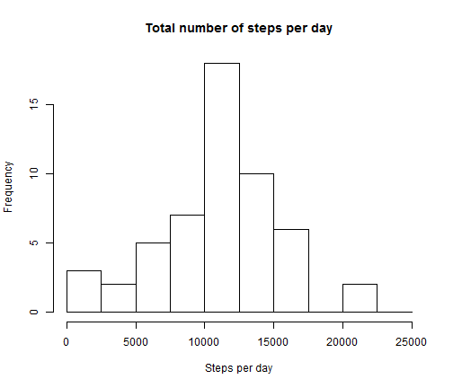

# Activity Monitoring #

## Data ##

57,568 observations on three variables: **steps**, **date** and **interval** are read into an R data table, *steps_taken*, from the csv file *activity.csv*. Libraries to be used in the analysis are also made available.

The term **interval** is a little inaccurate. The interval labels are in fact times measure from midnight (at time 0). Thus, 'interval 1235 is in fact 12.35pm and not the 1235th interval. I decided not to transform the 'intervals' into sequential interval numbers since the only impact in this study will be to introduce small gaps in the time series graph. Since no hypotheses are tested or predictions made this approach will have little impact.


```r
setwd("d:/documents/datascience/proj1/represproj1")
library(data.table)
library(ggplot2)
steps_taken <- data.table(read.table("activity.csv", sep=",", header = TRUE, na.strings = "NA"))
```

## Total Steps per Day ##

A histogram of the total number of steps taken per day is made. 


```r
hist(aggregate(steps ~ date, steps_taken, sum)$steps,
     breaks = c(0, 2500, 5000, 7500, 10000, 12500, 15000, 17500, 20000, 22500, 25000),
     main="Total number of steps per day",
     xlab = "Steps per day")
```

 

```r
mean_steps <- mean(data.table(aggregate(steps ~ date, steps_taken, sum, na.rm=TRUE))$steps)
median_steps <- median(data.table(aggregate(steps ~ date, steps_taken, sum, na.rm=TRUE))$steps)
```

The mean total number of steps per day is calculated


```r
print(mean_steps, digits=6)
```

```
## [1] 10766.2
```

The median number of steps per day is


```r
print(median_steps, digits=6)
```

```
## [1] 10765
```

## Average Daily Activity Pattern ##

The mean number of steps per interval, averaged over all days, are calculated.


```r
by_interval <- data.table(aggregate(steps ~ interval, steps_taken, mean, na.rm=TRUE))
```

These means are plotted against the period to give a time series plot.


```r
p <- ggplot(by_interval, aes(x=interval, y=steps))+ geom_line()
p + xlab("Interval") + ylab("Steps") + ggtitle("Mean steps per time interval")
```

 

The maximum average number of steps and its corresponding time period are calculated.


```r
max(by_interval$steps)
```

```
## [1] 206.2
```

```r
by_interval$interval[which.max(by_interval$steps)]
```

```
## [1] 835
```
That is, the maximum occurs between 8.35am and 8.40am

## Inputing Missing Values ##

There are missing values for eight days: in total  2304 missing values, which with 288 intervals per day, confirms 8 complete days unmeasured.

These missing values are imputed using the mean number of steps of the interval within which the missing value occurs. Added to the data table *steps_taken* is a variable, **imputed** which holds the imputed mean if *steps* is NA or the value of *steps* otherwise.


```r
setkey(steps_taken, interval)
setkey(by_interval, interval)
steps_taken$means <- rep(by_interval$steps, each=61)
steps_taken$imputed <- ifelse(is.na(steps_taken$steps), steps_taken$means, steps_taken$steps)
```

A histogram of the total number of steps taken each day is shown below.


```r
hist(aggregate(imputed ~ date, steps_taken, sum)$imputed,
     breaks = c(0, 2500, 5000, 7500, 10000, 12500, 15000, 17500, 20000, 22500, 25000),
     main="Total number of steps per day (Inputed data)",
     xlab = "Steps per day")
```

 

```r
mean_steps_imp <- mean(data.table(aggregate(imputed ~ date, steps_taken, sum, na.rm=TRUE))$imputed)
median_steps_imp <- median(data.table(aggregate(imputed ~ date, steps_taken, sum, na.rm=TRUE))$imputed)
```
The mean total number of steps per day is:


```r
print(mean_steps_imp, digits=6)
```

```
## [1] 10766.2
```

The median total number of steps per day is:


```r
print(median_steps_imp, digits=6)
```

```
## [1] 10766.2
```

Inspection reveals that initially there were data missing from eight days. The effect of imputing the mean value of the time period into all time periods of these eight days will have the following effect:

- The mean is unchanged since mean values were imputed.
- The median has been increased slightly. It is noted that many time periods related to sleeping and other sedentary activities will have zero steps recorded. Replacing values that would usually be zero with non-zero values will push the median upwards.
- There are more observations in the 10000 to 15000 range
- The data appears a little more symmetric about the mean

## Weekday and Weekend Activity Patterns ##

A factor variable **daytype** is added to the *steps_taken* data table. The factor is coded **weekend** if date falls on the Saturday or Sunday and **weekday** otherwise.


```r
steps_taken$daytype <- as.factor(ifelse(weekdays(as.POSIXct(steps_taken$date))=="Saturday" 
                                        | weekdays(as.POSIXct(steps_taken$date))=="Sunday",
                                        "weekend","weekday"))
```

Weekend and weekday activity is compared in the following panel plot:


```r
by_interval <- data.table(aggregate(imputed ~ interval + daytype, steps_taken, mean, na.rm=TRUE))
p <- ggplot(by_interval, aes(x=interval, y=imputed))+ geom_line(colour = "blue")
p <- p + xlab("Interval") + ylab("Mean number of steps per interval") 
p + facet_grid(daytype ~ .) +
  theme(strip.text = element_text(face="bold", size=rel(1.5)),
        strip.background = element_rect(fill="lightblue", colour="black", size=1))
```

 

The subject is more active earlier in the morning on weekdays and more active later at night on weekends.
