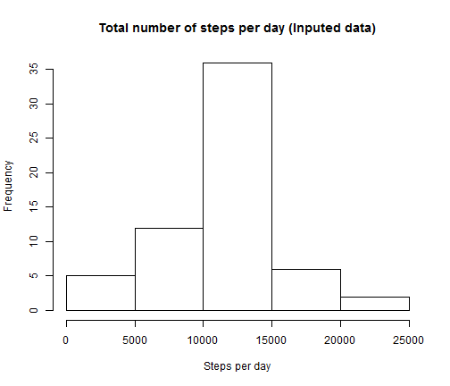

# Activity Monitoring #

## Data ##

57,568 observations on three variables: **steps**, **date** and **interval** are read into an R data table, *steps_taken*, from the csv file *activity.csv*. Libraries to be used in the analysis are also made available.


```r
setwd("D:/Documents/DataScience/proj1")
library(data.table)
library(ggplot2)
steps_taken <- data.table(read.table("activity.csv", sep = ",", header = TRUE, 
    na.strings = "NA"))
```


## Total Steps per Day ##

A histogram of the total number of steps taken per day is made. 


```r
hist(aggregate(steps ~ date, steps_taken, sum)$steps, main = "Total number of steps per day", 
    xlab = "Steps per day")
```

 

```r
mean_steps <- data.table(aggregate(steps ~ date, steps_taken, mean, na.rm = TRUE))
median_steps <- data.table(aggregate(steps ~ date, steps_taken, median, na.rm = TRUE))
```


The mean number of steps per day are.


```r
mean_steps
```

```
##           date   steps
##  1: 2012-10-02  0.4375
##  2: 2012-10-03 39.4167
##  3: 2012-10-04 42.0694
##  4: 2012-10-05 46.1597
##  5: 2012-10-06 53.5417
##  6: 2012-10-07 38.2465
##  7: 2012-10-09 44.4826
##  8: 2012-10-10 34.3750
##  9: 2012-10-11 35.7778
## 10: 2012-10-12 60.3542
## 11: 2012-10-13 43.1458
## 12: 2012-10-14 52.4236
## 13: 2012-10-15 35.2049
## 14: 2012-10-16 52.3750
## 15: 2012-10-17 46.7083
## 16: 2012-10-18 34.9167
## 17: 2012-10-19 41.0729
## 18: 2012-10-20 36.0938
## 19: 2012-10-21 30.6285
## 20: 2012-10-22 46.7361
## 21: 2012-10-23 30.9653
## 22: 2012-10-24 29.0104
## 23: 2012-10-25  8.6528
## 24: 2012-10-26 23.5347
## 25: 2012-10-27 35.1354
## 26: 2012-10-28 39.7847
## 27: 2012-10-29 17.4236
## 28: 2012-10-30 34.0938
## 29: 2012-10-31 53.5208
## 30: 2012-11-02 36.8056
## 31: 2012-11-03 36.7049
## 32: 2012-11-05 36.2465
## 33: 2012-11-06 28.9375
## 34: 2012-11-07 44.7326
## 35: 2012-11-08 11.1771
## 36: 2012-11-11 43.7778
## 37: 2012-11-12 37.3785
## 38: 2012-11-13 25.4722
## 39: 2012-11-15  0.1424
## 40: 2012-11-16 18.8924
## 41: 2012-11-17 49.7882
## 42: 2012-11-18 52.4653
## 43: 2012-11-19 30.6979
## 44: 2012-11-20 15.5278
## 45: 2012-11-21 44.3993
## 46: 2012-11-22 70.9271
## 47: 2012-11-23 73.5903
## 48: 2012-11-24 50.2708
## 49: 2012-11-25 41.0903
## 50: 2012-11-26 38.7569
## 51: 2012-11-27 47.3819
## 52: 2012-11-28 35.3576
## 53: 2012-11-29 24.4688
##           date   steps
```


The median number of steps per day are.


```r
median_steps
```

```
##           date steps
##  1: 2012-10-02     0
##  2: 2012-10-03     0
##  3: 2012-10-04     0
##  4: 2012-10-05     0
##  5: 2012-10-06     0
##  6: 2012-10-07     0
##  7: 2012-10-09     0
##  8: 2012-10-10     0
##  9: 2012-10-11     0
## 10: 2012-10-12     0
## 11: 2012-10-13     0
## 12: 2012-10-14     0
## 13: 2012-10-15     0
## 14: 2012-10-16     0
## 15: 2012-10-17     0
## 16: 2012-10-18     0
## 17: 2012-10-19     0
## 18: 2012-10-20     0
## 19: 2012-10-21     0
## 20: 2012-10-22     0
## 21: 2012-10-23     0
## 22: 2012-10-24     0
## 23: 2012-10-25     0
## 24: 2012-10-26     0
## 25: 2012-10-27     0
## 26: 2012-10-28     0
## 27: 2012-10-29     0
## 28: 2012-10-30     0
## 29: 2012-10-31     0
## 30: 2012-11-02     0
## 31: 2012-11-03     0
## 32: 2012-11-05     0
## 33: 2012-11-06     0
## 34: 2012-11-07     0
## 35: 2012-11-08     0
## 36: 2012-11-11     0
## 37: 2012-11-12     0
## 38: 2012-11-13     0
## 39: 2012-11-15     0
## 40: 2012-11-16     0
## 41: 2012-11-17     0
## 42: 2012-11-18     0
## 43: 2012-11-19     0
## 44: 2012-11-20     0
## 45: 2012-11-21     0
## 46: 2012-11-22     0
## 47: 2012-11-23     0
## 48: 2012-11-24     0
## 49: 2012-11-25     0
## 50: 2012-11-26     0
## 51: 2012-11-27     0
## 52: 2012-11-28     0
## 53: 2012-11-29     0
##           date steps
```


It is noted that 53 days in the 61 day period have means and medians reported. The other eight days consist of missing values (NA) in the dataset.

## Average Daily Activity Pattern ##

The mean number of steps per interval, averaged over all days, are calculated.


```r
by_interval <- data.table(aggregate(steps ~ interval, steps_taken, mean, na.rm = TRUE))
```


These means are plotted against the period to give a time series plot.


```r
p <- ggplot(by_interval, aes(x = interval, y = steps)) + geom_line()
p + xlab("Interval") + ylab("Steps") + ggtitle("Mean steps per time interval")
```

 


The maximum average number of steps is 206.1698 and occurs in time period 835.

## Inputing Missing Values ##

As previously stated, there are missing values for eight days: in total  2304 missing values, which with 288 intervals per day, confirms 8 complete days unmeasured.

These missing values are imputed using the mean number of steps of the interval within which the missing value occurs. Added to the data table *steps_taken* is a variable, **imputed** which holds the imputed mean if *steps* is NA or the value of *steps* otherwise.


```r
setkey(steps_taken, interval)
setkey(by_interval, interval)
steps_taken$means <- rep(by_interval$steps, each = 61)
steps_taken$imputed <- ifelse(is.na(steps_taken$steps), steps_taken$means, steps_taken$steps)
```


A histogram of the total number of steps taken each day is shown below.


```r
hist(aggregate(imputed ~ date, steps_taken, sum)$imputed, main = "Imputed /n Total number of steps per day", 
    xlab = "Steps per day")
```

 

```r
mean_steps_imp <- data.table(aggregate(imputed ~ date, steps_taken, mean, na.rm = TRUE))
median_steps_imp <- data.table(aggregate(imputed ~ date, steps_taken, median, 
    na.rm = TRUE))
```

The mean number of steps per day are.


```r
mean_steps_imp
```

```
##           date imputed
##  1: 2012-10-01 37.3826
##  2: 2012-10-02  0.4375
##  3: 2012-10-03 39.4167
##  4: 2012-10-04 42.0694
##  5: 2012-10-05 46.1597
##  6: 2012-10-06 53.5417
##  7: 2012-10-07 38.2465
##  8: 2012-10-08 37.3826
##  9: 2012-10-09 44.4826
## 10: 2012-10-10 34.3750
## 11: 2012-10-11 35.7778
## 12: 2012-10-12 60.3542
## 13: 2012-10-13 43.1458
## 14: 2012-10-14 52.4236
## 15: 2012-10-15 35.2049
## 16: 2012-10-16 52.3750
## 17: 2012-10-17 46.7083
## 18: 2012-10-18 34.9167
## 19: 2012-10-19 41.0729
## 20: 2012-10-20 36.0938
## 21: 2012-10-21 30.6285
## 22: 2012-10-22 46.7361
## 23: 2012-10-23 30.9653
## 24: 2012-10-24 29.0104
## 25: 2012-10-25  8.6528
## 26: 2012-10-26 23.5347
## 27: 2012-10-27 35.1354
## 28: 2012-10-28 39.7847
## 29: 2012-10-29 17.4236
## 30: 2012-10-30 34.0938
## 31: 2012-10-31 53.5208
## 32: 2012-11-01 37.3826
## 33: 2012-11-02 36.8056
## 34: 2012-11-03 36.7049
## 35: 2012-11-04 37.3826
## 36: 2012-11-05 36.2465
## 37: 2012-11-06 28.9375
## 38: 2012-11-07 44.7326
## 39: 2012-11-08 11.1771
## 40: 2012-11-09 37.3826
## 41: 2012-11-10 37.3826
## 42: 2012-11-11 43.7778
## 43: 2012-11-12 37.3785
## 44: 2012-11-13 25.4722
## 45: 2012-11-14 37.3826
## 46: 2012-11-15  0.1424
## 47: 2012-11-16 18.8924
## 48: 2012-11-17 49.7882
## 49: 2012-11-18 52.4653
## 50: 2012-11-19 30.6979
## 51: 2012-11-20 15.5278
## 52: 2012-11-21 44.3993
## 53: 2012-11-22 70.9271
## 54: 2012-11-23 73.5903
## 55: 2012-11-24 50.2708
## 56: 2012-11-25 41.0903
## 57: 2012-11-26 38.7569
## 58: 2012-11-27 47.3819
## 59: 2012-11-28 35.3576
## 60: 2012-11-29 24.4688
## 61: 2012-11-30 37.3826
##           date imputed
```


The median number of steps per day are.


```r
median_steps_imp
```

```
##           date imputed
##  1: 2012-10-01   34.11
##  2: 2012-10-02    0.00
##  3: 2012-10-03    0.00
##  4: 2012-10-04    0.00
##  5: 2012-10-05    0.00
##  6: 2012-10-06    0.00
##  7: 2012-10-07    0.00
##  8: 2012-10-08   34.11
##  9: 2012-10-09    0.00
## 10: 2012-10-10    0.00
## 11: 2012-10-11    0.00
## 12: 2012-10-12    0.00
## 13: 2012-10-13    0.00
## 14: 2012-10-14    0.00
## 15: 2012-10-15    0.00
## 16: 2012-10-16    0.00
## 17: 2012-10-17    0.00
## 18: 2012-10-18    0.00
## 19: 2012-10-19    0.00
## 20: 2012-10-20    0.00
## 21: 2012-10-21    0.00
## 22: 2012-10-22    0.00
## 23: 2012-10-23    0.00
## 24: 2012-10-24    0.00
## 25: 2012-10-25    0.00
## 26: 2012-10-26    0.00
## 27: 2012-10-27    0.00
## 28: 2012-10-28    0.00
## 29: 2012-10-29    0.00
## 30: 2012-10-30    0.00
## 31: 2012-10-31    0.00
## 32: 2012-11-01   34.11
## 33: 2012-11-02    0.00
## 34: 2012-11-03    0.00
## 35: 2012-11-04   34.11
## 36: 2012-11-05    0.00
## 37: 2012-11-06    0.00
## 38: 2012-11-07    0.00
## 39: 2012-11-08    0.00
## 40: 2012-11-09   34.11
## 41: 2012-11-10   34.11
## 42: 2012-11-11    0.00
## 43: 2012-11-12    0.00
## 44: 2012-11-13    0.00
## 45: 2012-11-14   34.11
## 46: 2012-11-15    0.00
## 47: 2012-11-16    0.00
## 48: 2012-11-17    0.00
## 49: 2012-11-18    0.00
## 50: 2012-11-19    0.00
## 51: 2012-11-20    0.00
## 52: 2012-11-21    0.00
## 53: 2012-11-22    0.00
## 54: 2012-11-23    0.00
## 55: 2012-11-24    0.00
## 56: 2012-11-25    0.00
## 57: 2012-11-26    0.00
## 58: 2012-11-27    0.00
## 59: 2012-11-28    0.00
## 60: 2012-11-29    0.00
## 61: 2012-11-30   34.11
##           date imputed
```


Inspection reveals that the 8 missing days now have reported means and medians with the medians non-zero for the days with iputed values. This contrasts with other days where zeroes make up at least 50% of daily measuments.

Clearly, there should be no differences, other than for the eight days with imputed step measurements, between the original daily means and the daily means with imputed values. This is confirmed in the following table comparing the means before and after imputation:


```r
setkey(mean_steps, date)
setkey(mean_steps_imp, date)
compare_means <- merge(mean_steps, mean_steps_imp)
compare_means$diff <- compare_means$imputed - compare_means$steps
compare_means
```

```
##           date   steps imputed diff
##  1: 2012-10-02  0.4375  0.4375    0
##  2: 2012-10-03 39.4167 39.4167    0
##  3: 2012-10-04 42.0694 42.0694    0
##  4: 2012-10-05 46.1597 46.1597    0
##  5: 2012-10-06 53.5417 53.5417    0
##  6: 2012-10-07 38.2465 38.2465    0
##  7: 2012-10-09 44.4826 44.4826    0
##  8: 2012-10-10 34.3750 34.3750    0
##  9: 2012-10-11 35.7778 35.7778    0
## 10: 2012-10-12 60.3542 60.3542    0
## 11: 2012-10-13 43.1458 43.1458    0
## 12: 2012-10-14 52.4236 52.4236    0
## 13: 2012-10-15 35.2049 35.2049    0
## 14: 2012-10-16 52.3750 52.3750    0
## 15: 2012-10-17 46.7083 46.7083    0
## 16: 2012-10-18 34.9167 34.9167    0
## 17: 2012-10-19 41.0729 41.0729    0
## 18: 2012-10-20 36.0938 36.0938    0
## 19: 2012-10-21 30.6285 30.6285    0
## 20: 2012-10-22 46.7361 46.7361    0
## 21: 2012-10-23 30.9653 30.9653    0
## 22: 2012-10-24 29.0104 29.0104    0
## 23: 2012-10-25  8.6528  8.6528    0
## 24: 2012-10-26 23.5347 23.5347    0
## 25: 2012-10-27 35.1354 35.1354    0
## 26: 2012-10-28 39.7847 39.7847    0
## 27: 2012-10-29 17.4236 17.4236    0
## 28: 2012-10-30 34.0938 34.0938    0
## 29: 2012-10-31 53.5208 53.5208    0
## 30: 2012-11-02 36.8056 36.8056    0
## 31: 2012-11-03 36.7049 36.7049    0
## 32: 2012-11-05 36.2465 36.2465    0
## 33: 2012-11-06 28.9375 28.9375    0
## 34: 2012-11-07 44.7326 44.7326    0
## 35: 2012-11-08 11.1771 11.1771    0
## 36: 2012-11-11 43.7778 43.7778    0
## 37: 2012-11-12 37.3785 37.3785    0
## 38: 2012-11-13 25.4722 25.4722    0
## 39: 2012-11-15  0.1424  0.1424    0
## 40: 2012-11-16 18.8924 18.8924    0
## 41: 2012-11-17 49.7882 49.7882    0
## 42: 2012-11-18 52.4653 52.4653    0
## 43: 2012-11-19 30.6979 30.6979    0
## 44: 2012-11-20 15.5278 15.5278    0
## 45: 2012-11-21 44.3993 44.3993    0
## 46: 2012-11-22 70.9271 70.9271    0
## 47: 2012-11-23 73.5903 73.5903    0
## 48: 2012-11-24 50.2708 50.2708    0
## 49: 2012-11-25 41.0903 41.0903    0
## 50: 2012-11-26 38.7569 38.7569    0
## 51: 2012-11-27 47.3819 47.3819    0
## 52: 2012-11-28 35.3576 35.3576    0
## 53: 2012-11-29 24.4688 24.4688    0
##           date   steps imputed diff
```


The impact of the imputation is to provide measurements for eight complete days where no steps were measured. A better imputation regime could take account of the presence 50% of time periods there were zero steps measured, perhaps relating to resting, sleeping and other non-movement activities.

## Weekday and Weekend Activity Patterns ##

A factor variable **daytype** is added to the *steps_taken* data table. The factor is coded **weekend** if date falls on the Saturday or Sunday and **weekday** otherwise.


```r
steps_taken$daytype <- as.factor(ifelse(weekdays(as.POSIXct(steps_taken$date)) == 
    "Saturday" | weekdays(as.POSIXct(steps_taken$date)) == "Sunday", "weekend", 
    "weekday"))
```


Weekend and weekday activity is compared in the following panel plot:


```r
by_interval <- data.table(aggregate(imputed ~ interval + daytype, steps_taken, 
    mean, na.rm = TRUE))
p <- ggplot(by_interval, aes(x = interval, y = imputed)) + geom_line(colour = "blue")
p <- p + xlab("Interval") + ylab("Mean number of steps per interval")
p + facet_grid(daytype ~ .) + theme(strip.text = element_text(face = "bold", 
    size = rel(1.5)), strip.background = element_rect(fill = "lightblue", colour = "black", 
    size = 1))
```

 

